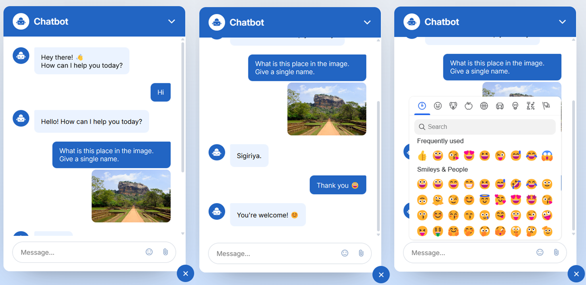

# 🤖 YuYu – Lightweight Chatbot with Gemini API

YuYu is a simple and friendly web-based chatbot that allows users to send text and image messages and receive smart responses via the Gemini API. Built with HTML, CSS, and JavaScript on the frontend and powered by Node.js + Express on the backend.

## ✨ Features

- Real-time Text Messaging
- Images and Emoji Sharing
- Intelligent Replies Powered by Gemini API
- Clean and User-Friendly Interface
- Frontend-backend integration with Express

## 📦 Tech Stack

### 🖥️ Frontend
- HTML, CSS, JavaScript  
- Google Fonts & Material Icons  
- [Emoji Mart](https://github.com/missive/emoji-mart) – Emoji Picker

### 🛠️ Backend
- Node.js  
- Express.js  
- Multer – File Upload Handling

### 🔌 API Integration
- [Gemini API (by Google)](https://ai.google.dev/gemini-api)

## 🚀 Project Setup Guide

Follow the steps below to set up and run the **Yuyu AI Chatbot** locally:

### 1. Clone the repository

Clone the project repository to your local machine using the following command:
```
git clone https://github.com/bpk00/Yuyu-AI-Chatbot.git 
cd yuyu-ai-chatbot
```

### 2. Install Backend Dependencies 

Navigate to the project folder and run the following commands to install the backend dependencies:
```
cd backend
npm install
```

### 3. Add Your Gemini API Key

In the `backend` directory, locate the `.env.example` file. Rename it to `.env` file and and add your **Gemini API** key like this:
```
GEMINI_API_KEY = your_actual_api_key_here
```

### 4. Start the Backend Server

Once you've set up the API key, start the backend server:
- Open the `backend` folder in your terminal.
- Run the command to start the server:
```
npm run dev
```

### 5. Run the Frontend

To run the frontend:
1.  Open the `frontend` folder.
2.  You can either:
   - Open the `index.html` file directly in a browser, or
   - Serve it using a local server (such as **Live Server** extension in Visual Studio Code or **http-server**).

### Notes:
- Ensure that both the backend and frontend are running simultaneously for proper communication between the two.
- If you encounter any issues, check the terminal for error messages.

### YuYu - AI Chatbot Interface Preview

<p align="center">
  
</p> 

